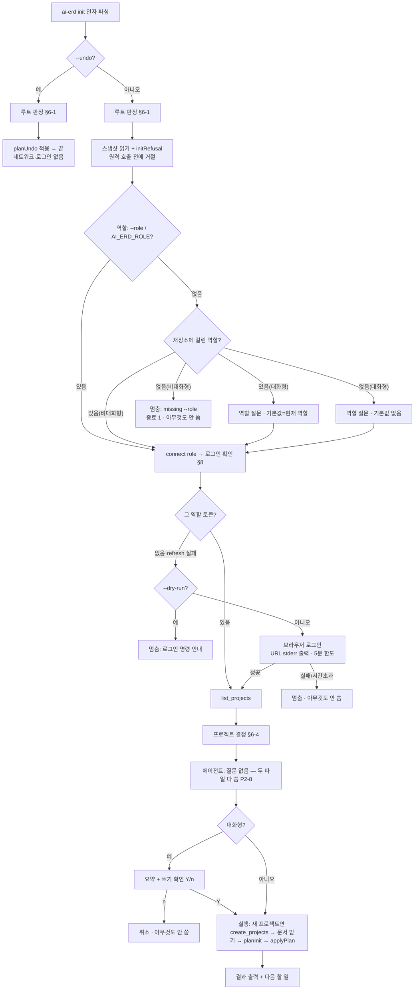

# `ai-erd init` 대화형 설계 (2026-09-29)

> 상태: **설계만.** 독립 리뷰 판정 = 조건부 GO(P0 1건 — 이 판에서 반영, §13·§16-1·§18). 사용자 결정 Q1·Q2 확정(2026-09-29, §18). 리뷰 P1/P2 전부 반영 결정(§20). 구현은 두 단계 — 1단계 비대화형(§21-1), 2단계 대화형(§21-2).
> 코드는 한 줄도 바꾸지 않았다. 설계→리뷰→수정→리뷰 순서를 따르며, 구현 중에 새 결정이 필요해지면 구현을 멈추고 이 문서를 먼저 고친다.
> 대상: `@ai-erd/mcp` 0.3.0 (HEAD `cd0066d`), ainecto-api `dev`, ainecto-document-front `31b17c7`.
> 표기: **[확인]** = 이번에 코드·문서를 읽어 확인한 사실(파일:행 첨부). **[추정]** = 확인하지 않은 가정. **[미확인]** = 확인 방법을 §15 검증 항목에 적은 것.

---

## 0. 합격 시나리오 — 모든 결정은 이 다섯 단계를 통과하는지로 판정한다

사용자가 준 시나리오를 문서 맨 앞에 둔다. 아래 결정은 모두 이 표에서 "통과"가 되는지로 판정했다.

| # | 시나리오 | Claude Code | Codex | 판정 |
|---|---|---|---|---|
| 1 | 사용자: "ai-erd mcp 설치해줘" → 에이전트가 설치 | 에이전트가 npm 페이지(README)의 «For AI agents» 한 줄을 보고 `claude mcp add --scope user --transport http ai-erd https://ai-erd.com/mcp` 을 실행한다. 첫 호출 때 Claude Code 가 OAuth 를 직접 한다(`/mcp` → 브라우저). **새 명령 없음.** | `codex mcp add ai-erd --url https://ai-erd.com/mcp` → 첫 호출 때 OAuth. **[미확인]** Codex 의 HTTP MCP OAuth(`codex mcp login`)는 판마다 다르다(V4). | 통과(Codex 는 V4 조건부) — §11 |
| 2 | 역할 없는 첫 세션: 서버 안내에 따라 에이전트가 "역할을 고르라"고 묻는다 | 서버 `initialize` 안내문(`HARNESS.INSTRUCTIONS` 새 판)이 «역할을 사용자에게 묻고, 스스로 고르지 말라»를 말한다. | 같다(같은 안내문). | 통과 — §10 |
| 3 | 사용자가 고르면 에이전트가 저장소 루트에서 `ai-erd init --role <role>` 실행(비TTY) | Bash 도구로 `npx -y -p @ai-erd/mcp ai-erd init --role design`. 비대화형이므로 묻지 않는다. 프로젝트가 여럿이면 목록을 내고 멈춘다 → 에이전트가 사용자에게 묻고 `--project` 로 다시 친다. | 같다. ⚠Codex 기본 샌드박스는 네트워크를 막으므로 사용자 승인(권한 상승)이 한 번 든다 **[추정]**. | 통과 — §4·§6 |
| 4 | 로그인이 없으면 init 이 브라우저를 띄워 로그인까지(비TTY 에서도) | init 이 그 역할의 토큰이 없으면 `OAuthClient.login()` 을 부른다. 인가 URL 을 stderr 에 먼저 찍고, 브라우저를 열고, localhost 콜백을 **5분 한도**로 기다린다. 브라우저를 열 수 없으면 즉시 실패하고 그 사실을 말한다. | 같다. | 통과(현 코드는 **미통과** — 타임아웃 없음, URL 안 찍음, 브라우저 실행 실패 시 프로세스가 죽음 [확인] §8-1) |
| 5 | 사용자가 별도 터미널을 열지 않고 대화만으로 끝난다 | init 이 끝나면 에이전트가 "새 세션부터 적용된다 — Claude Code 를 종료하고 `claude -c` 로 대화를 이어라"를 전한다. 새 세션 시작 때 `.mcp.json` 서버 승인 창에 한 번 답한다. | init 이 Codex 전역 설정을 못 고치므로 역할 프로필 파일(`$CODEX_HOME/<role>.config.toml`) 내용을 출력한다. 에이전트가 사용자 승인을 받아 그 파일을 쓰고, 사용자는 `codex -p <role>` 로 다시 시작한다. | Claude Code 통과(재시작 1회는 불가피 — §9) · Codex 부분 통과(재시작 때 `-p <role>` 을 쳐야 함) |

**재시작 1회는 어떤 방식으로도 없앨 수 없었다**(§9). 떠 있는 세션의 역할을 바꾸지 않는 것이 하네스의 핵심 불변식이기 때문이다. "별도 터미널을 열지 않는다"는 지키지만 "같은 세션에서 끝난다"는 약속하지 않는다.

---

## 1. 핵심 결정 (요약)

1. **경로는 CLI 다**: `ai-erd init --role` + 브라우저 로그인. MCP 표준 경로 중 (A) scope step-up 은 클라이언트 지원을 확인한 뒤의 후속 과제로 두고, (B) elicitation 은 기각한다. elicitation 은 우리 전송 계층에 서버→클라이언트 요청 통로가 없고, 받은 값이 토큰에 실리지 않는다(§3).
2. **프롬프트는 `node:readline` 한 모듈로 만든다.** 새 의존성은 0이다. 번호로 고르는 방식만 쓰고, `Prompter` 인터페이스를 주입해 시험한다(§7).
3. **대화형 판정은 `stdin.isTTY && stdout.isTTY && !--json` 이다.** 비대화형에서는 빠진 값(역할·프로젝트)을 말하고 멈춘다. 다만 **`--role` 이 주어지면 비TTY 에서도 브라우저 로그인까지 진행한다**(시나리오 4)(§5).
4. **역할은 새 세션부터 적용된다.** 떠 있는 브리지가 역할을 이어받게 하는 안은 기각했다(§9).
5. **역할 없는 세션용 안내문은 `HARNESS.INSTRUCTIONS` 의 새 판(레지스트리 데이터)으로 넣는다.** 서버 코드 변경은 0이다(§10).
0. **역할은 작업 가드레일이다. 보안 경계가 아니다**(사용자 결정 Q1). 이 설계와 모든 안내 문구는 «에이전트가 못 한다»를 말하지 않는다. 참인 세 가지만 말한다 — 떠 있는 세션은 역할이 바뀌지 않는다, 역할은 사람이 고른다, 처음 받는 역할 토큰에는 브라우저 승인이 든다(§16-1).
6. **1단계 설치에는 새 명령을 만들지 않는다.** 이미 있는 HTTP 직결 한 줄을 **user scope** 로 안내한다. 지금 문서의 local scope 안내는 init 이 쓰는 `.mcp.json` 을 **가려서 역할이 영영 안 걸린다**(§11, 결함).

---

## 2. 현재 코드에서 확인한 사실

| 사실 | 근거 |
|---|---|
| init 은 대화형 프롬프트를 쓰지 않는다고 머리 주석에 못 박혀 있다. 고를 것이 여럿이면 목록을 내고 «다시 실행하라»고 한다. | `src/adapters/cli/initCommand.ts:52-58, 96-105` |
| 첫 실행에 역할이 없으면 예외를 던진다. | `initCommand.ts:79-84` |
| 401 을 받으면 로그인하지 않고 `ai-erd auth login --role X` 을 치라고 안내한다. 자동 로그인을 하지 않는 이유로 "같은 클라이언트를 stdio 브리지가 쓴다"를 든다. | `initCommand.ts:267-294` |
| 프로젝트 목록은 MCP 도구 `list_projects`(인자 `{}`)로 가져온다. 응답은 `{projects:[…], count, mode:"list"}` 이고, 쿼리 `q` 가 없으면 **읽을 수 있는 프로젝트 전부**가 온다(상한 없음). | `initCommand.ts:262-265`, ainecto-api `mcp/handlers/markdown/ListProjectsToolHandler.java:50-55` |
| 새 프로젝트는 `create_projects {items:[{name}]}` 로 만든다. | `initCommand.ts:320-329` |
| ★`create_projects` 는 **Design(과 FULL)만** 부를 수 있다. Development·Validation 은 쓰기가 전부 막히고, Test 는 testcase 도구만 열린다. ⇒ `init --role test --yes` 로 프로젝트를 만들면 서버가 거부 결과를 주고, init 은 「Project creation did not return a project uuid.」라는 엉뚱한 말로 끝난다. **기존 결함.** | ainecto-api `mcp/harness/McpRolePolicy.java:100-120` |
| 역할은 전역 파서가 한 번 정하고, init 만 예외로 클라이언트를 만들기 전에 저장소의 역할을 읽는다. | `src/adapters/cli/ainectoCli.ts:34-48` |
| 계획(`planInit`)은 `AGENT_TARGETS`(Claude Code `.mcp.json`, Cursor `.cursor/mcp.json`) **둘 다**에 항상 쓴다. 에이전트를 고르는 칸이 없다. undo 는 기록을 보고 움직이므로 대상 목록에 기대지 않는다. | `src/core/harness/initPlan.ts:312`, `agentTargets.ts:41-44` |
| Codex 는 전역 설정뿐이라 init 이 건드리지 않고 명령·프로필만 출력한다. | `agentTargets.ts:7-21, 185-208` |
| 토큰은 `~/.ainecto/tokens.json` 한 파일에 있다. 키는 `sha256(endpoint + "#role=" + role)`(역할이 없으면 `sha256(endpoint)`)이고, 파일 0600·디렉터리 0700 으로 원자 교체한다. | `src/core/auth/tokenStore.ts:27-78, 100-103` |
| `getAccessToken()` 은 호출마다 `tokenStore.load(endpoint, options.role)` 로 다시 읽는다. 만료 60초 전이면 refresh 하고, 401 이면 `sendRaw` 가 `refreshAfterUnauthorized` 뒤에 한 번 재시도한다. **읽는 칸은 클라이언트를 만들 때 정한 `options.role` 칸뿐이다.** | `src/core/auth/oauth.ts:44-69`, `src/core/mcp/rpcClient.ts:93-101` |
| 브리지의 역할은 프로세스를 시작할 때 `--role` 또는 `AI_ERD_ROLE` 로 정해지고, 그 뒤로 바뀌지 않는다. | `src/bin/mcp.ts:17-25`, `src/adapters/mcp/connector.ts:16-33` |
| `login()` 은 인가 URL 에 `scope=mcp ai-erd:role:<role>` 을 싣고, PKCE S256 과 state 를 쓰며, `127.0.0.1:<임의 포트>/callback` 으로 받는다. **대기에 타임아웃이 없고, 인가 URL 을 어디에도 출력하지 않는다.** 브라우저는 `spawn(open/xdg-open/explorer.exe, {detached})` 로 여는데 `error` 리스너가 없다. | `oauth.ts:71-114, 245-293, 332-336` |
| TTY 에 기대는 곳은 login 에 없다. 비TTY 에서도 동작은 한다. 모자란 것은 위의 세 가지(타임아웃·URL·실행 실패 처리)다. | 같은 곳 |
| 이미 readline 기반 프롬프트가 하나 있다(파괴적 명령 확인, `terminal:false`, 줄마다 인터페이스를 새로 만든다). | `src/adapters/cli/destructiveConfirmation.ts:37-47` |
| 런타임 의존성은 **0개**다(`devDependencies` 만 있다). 이 패키지는 모든 에이전트 세션 시작 때 `npx -y @ai-erd/mcp` 로 받아진다. | `package.json` |
| 서버는 `/mcp` 와 `/mcp/**` 에 인증을 요구한다. `initialize` 도 예외가 아니다. | ainecto-api `mcp/McpSecurityConfig.java:74-78` |
| 역할이 없으면 `instructionsFor` 는 `HARNESS.INSTRUCTIONS` 하나만 렌더한다(지금 본문은 ERD 일괄 변경 요령 한 줄). 역할이 있으면 `ROLE_INSTRUCTIONS + INSTRUCTIONS.COMMON + INSTRUCTIONS.<ROLE>` 을 합친다. | ainecto-api `mcp/McpProtocolHandler.java:344-372`, `mcp/harness/HarnessPromptCatalog.java:245-266` |
| `HARNESS.INSTRUCTIONS` 의 수신자는 «역할 없는(호환) 세션»뿐이라고 카탈로그에 명시돼 있다. 정의 행은 V197 에 이미 있다. | `HarnessPromptCatalog.java:76-98`, `V197__harness_prompt_registry_seed.sql:14-19` |
| 역할 scope 는 "좁히기만 한다"는 이유로 등록 scope 검증을 건너뛴다. 한 번에 하나만 받고, 모르는 역할이면 거절한다. | ainecto-api `auth/oauth2server/OAuth2McpScopeGrantService.java:18-50` |
| 동의 화면은 scope 를 **날 문자열 목록**으로 보여 준다(`ai-erd:role:design` 이 그대로 뜬다). 역할 scope 가 붙은 요청은 1st-party 자동 동의 대상이 아니다. | `templates/oauth2/consent.html:34-35`, `OAuth2AuthorizationController.java:104-121, 221-227` |
| `scopes_supported` 는 `openid profile email mcp` 이고 역할 scope 는 광고하지 않는다. `insufficient_scope` 응답 작성기는 이미 있다. | `OAuth2DiscoveryConfig.java:29`, `McpJwtAuthenticationFilter.java:321-333` |
| 브리지는 원격 호출이 실패하면 `id: null` 인 JSON-RPC 오류를 쓴다. 요청을 파싱한 뒤에도 id 를 잃는다. ⇒ 토큰 없이 뜬 브리지의 `initialize` 는 클라이언트가 짝을 못 맞추는 오류로 끝난다. | `src/core/mcp/stdioBridge.ts:17-34` |
| Claude Code MCP scope 우선순위는 **local > project > user** 이고 필드를 합치지 않는다. project(`.mcp.json`) 서버는 첫 사용 때 승인 창이 뜬다. `/mcp reconnect` 가 바뀐 설정을 다시 읽는지는 문서에 없다. | code.claude.com/docs/en/mcp.md (공식 문서 인용 확인) |

---

## 3. 방식 비교 — CLI 경로 vs MCP 표준 경로

| | ① CLI 경로 (권장) `ai-erd init --role` + 브라우저 로그인 | (A) MCP Authorization scope step-up (HTTP 직결) | (B) MCP elicitation | (b′) 떠 있는 브리지가 저장소 역할을 요청마다 재해석 |
|---|---|---|---|---|
| 동작 | 사람이 고른 역할로 에이전트가 init 실행 → 역할 토큰 로그인(브라우저) → `.mcp.json` 에 `--role` 브리지 항목 → 새 세션 | 서버가 역할이 필요할 때 `403 insufficient_scope, scope="mcp ai-erd:role:design"` → 클라이언트가 브라우저 재인가 → 새 토큰에 역할 | 서버가 세션 중에 `elicitation/create`(form: 역할 선택 / url: 인가 URL)를 보낸다 | 역할 없이 뜬 브리지가 요청마다 `.mcp.json` 의 `--role` 을 읽어, 한 번 역할을 얻으면 그 칸으로 갈아탄다(한 방향 래치) |
| 시나리오 5단계 | **전부 통과**(Codex 는 5단계 부분) | **2·3 불통과**: 서버가 «어느 역할»을 요구할지 알 길이 없다. 결국 헤더나 설정으로 누가 알려 줘야 한다 → ①로 돌아온다 | 2 통과 가능. 3 대신 form 을 쓴다. 4 는 url mode. **전송 계층이 없어 지금 불통과** | 4 뒤 재시작 없이 적용. 1~3 은 ①과 같다 |
| 재연결 필요 | 필요(새 세션 1회) | 불필요 **[미확인]**(클라이언트가 재인가 뒤 같은 연결을 쓰는지) | 불필요(세션 상태로 들고 있을 때) | 불필요 |
| 역할을 누가 고르나 (가드레일 기준) | 사람이 고르고, 에이전트가 그 답으로 적용한다(Q2). 역할 토큰이 처음이면 브라우저 승인이 든다. 이미 있으면 승인 없이 적용된다 — 수용한 한계(§13 S1) | 사람이 클라이언트 설정(헤더)에 적는다. 에이전트도 고칠 수 있다. 처음이면 동의 화면을 거친다 | elicitation 응답은 스펙상 사람에게 가지만 **서버는 그것을 검증할 수 없다**(클라이언트 구현을 믿어야 한다) | 에이전트가 파일을 고쳐 래치 역할을 고를 수 있다. 역할 없음(FULL)에서 좁히는 방향뿐이라 권한 상승은 아니다 |
| 토큰에 역할이 실리나 (role.ts 원칙) | 실린다 | 실린다 | **안 실린다** — 같은 토큰을 쓰는 다른 경로(CLI `tools call`)는 제한 없이 남는다 | 실린다(래치 뒤) |
| 우리 코드 변경량 | CLI 중간 규모(§14), 서버 0(안내문은 데이터) | 서버: 헤더 역할 → step-up 전환, `scopes_supported` 에 역할 scope, 동의 화면 역할 표기. 클라이언트 0 | 브리지·서버에 Streamable HTTP(SSE + `MCP-Session-Id`)를 새로 만들고, 서버에 세션 상태를 둔다. **가장 크다**(README Known Limitations: SSE·세션 미구현) | 브리지 ~40줄 + 래치 + 시험, role.ts 의 "출처는 둘" 원칙에 셋째 출처 |
| 클라이언트 의존성 | 셸 도구, 브라우저, `claude`/`codex` 재시작 | step-up 재인가 지원 **[미확인]**, Claude Code 토큰 캐시가 서버 URL 단위라 저장소마다 다른 역할이 섞일 위험 **[추정]** | elicitation 지원 **[미확인]** | 없음 |
| 보안 | §13 S1(수용한 한계)·S4(P1, 신규 문구 경로) | 동의 화면이 게이트. 역할 scope 는 좁히기만 하므로 임의 요청이어도 상승은 없다 | 사람 입력 보증이 클라이언트 UI 에만 있다. 토큰 비결속 | 역할이 세션 도중에 바뀐다(FULL→X). 캐시된 도구 목록이 거짓이 된다 |
| 판정 | **채택** | **후속**: V6(클라이언트 step-up 지원) 확인 뒤 별도 설계. 채택하더라도 «어느 역할»은 사람이 설정에 적어야 한다 | **기각**(지금) | **기각**(§9) |

**권장: ①.** 시나리오 다섯 단계를 확인된 클라이언트 동작만으로 통과하는 안은 이것 하나다. 서버 코드도 바꾸지 않는다.

---

## 4. 흐름도

### 4-1. 전체 (대화형·비대화형 공통 골격)



### 4-2. 취소 (Ctrl+C / EOF) 의미

| 시점 | 저장소 파일 | 원격 | 토큰 저장소 |
|---|---|---|---|
| 확인(Y) **전** 어디서든 | 안 씀 | 안 씀(`list_projects` 읽기뿐) | 로그인을 **끝낸 뒤**라면 그 역할 토큰이 남는다. 사용자가 브라우저에서 승인한 결과이므로 되돌리지 않는다. 출력에 적는다 |
| 로그인 대기 중 | 안 씀 | 안 씀 | 안 씀(콜백 전) |
| 확인(Y) **뒤** | `applyPlan` 의 기존 보장 그대로: 기록을 먼저 쓰고, 파일마다 임시 파일 + rename 한다. 중간에 죽으면 `--undo` 로 되돌린다 | 새 프로젝트는 만들어진 채로 남는다(출력 전에 죽으면 사용자는 모른다 — §13 S9) | — |

- **모든 질문을 원격 쓰기보다 앞에 둔다.** `create_projects` 는 확인 뒤 «실행» 단계로 미룬다. 지금 코드는 프로젝트 결정 단계에서 바로 만든다(`initCommand.ts:259`). 이 순서를 바꿔야 "취소하면 아무것도 안 남는다"가 참이 된다.
- Ctrl+C 는 핸들러 없이 기본 SIGINT 로 끝낸다(종료 130). 프롬프트는 cooked 모드(`terminal:false`)라 터미널 드라이버가 SIGINT 를 보낸다. raw 모드였다면 readline 이 SIGINT 를 가로채 `pause` 만 하므로 **멈추지 않는다** — 이것이 raw 모드(화살표 메뉴)를 안 쓰는 이유 중 하나다.
- 질문 중 stdin 이 EOF(Ctrl+D)면 취소로 본다: 「Cancelled — nothing was written.」, 종료 130.

---

## 5. 대화형 판정 규칙

```
interactive = io.stdin.isTTY === true && io.stdout.isTTY === true && !json
```

- **두 스트림을 다 보는 이유.** stdin 이 파이프면 답을 받을 수 없다. stdout 이 파이프(`| tee`, 에이전트 캡처)면 사람이 화면을 보고 있다는 보장이 없다. Claude Code·Codex 의 셸 도구는 둘 다 TTY 가 아니다 **[추정, V3 에서 실측]**.
- **`--json` 은 기계가 읽는다는 선언**이므로 TTY 여도 묻지 않는다(파괴적 명령 확인의 기존 규칙과 같다, `destructiveConfirmation.ts:23-27`).
- 환경변수(`CI` 등)는 보지 않는다. CI 는 원래 TTY 가 없다.
- **비대화형 규칙.** 목적은 사람이 고르지 않은 역할이 기본값으로 조용히 걸리지 않게 하는 것이다. 에이전트를 막는 장치가 아니다 — 에이전트는 `--role` 을 직접 붙일 수 있다. 가드레일은 «역할 값을 사용자에게 물어 온다»는 안내문(§10-3)과 이 멈춤이 함께 만든다:
  - **기본값으로 역할을 채우지 않는다.** `--role`·`AI_ERD_ROLE`·저장소에 이미 걸린 역할 중 하나가 없으면 「missing: --role <design|development|test|validation>」을 말하고 멈춘다(종료 1).
  - 프로젝트가 둘 이상인데 `--project` 도 연결된 프로젝트도 없으면 목록을 내고 멈춘다(지금과 같다).
  - 프로젝트가 0개면 `--yes` 가 있을 때만 만든다(지금과 같다). 추가로 역할이 Design 이 아니면 **원격 호출 전에** 멈춘다(§6-4).
  - 에이전트 대상은 묻지 않는다: 두 파일 다 쓴다(P2-8, §6-5 삭제).
  - 로그인은 **한다**(시나리오 4). 역할 값이 명시돼 있기 때문이다. `--dry-run` 이면 하지 않는다.
- **알려진 한계.** pty 를 할당하는 에이전트 터미널(Cursor 에이전트가 그렇다는 말이 있음 **[미확인]**, V5)은 대화형으로 보인다. 그러면 첫 질문에서 에이전트 명령이 멈춘다. 안내문은 에이전트에게 항상 `--role` 을 붙이라고 하므로 역할 질문은 생략되지만, 프로젝트·에이전트·확인 질문은 남는다. V5 가 사실로 확인되면 규칙에 한 줄(그 에이전트의 환경 표지)을 더한다. 지금 넣지 않는 이유는 빈도가 확인되지 않았기 때문이다.

---

## 6. 질문별 상세

모든 질문은 번호로 고른다. 기본값은 `[ ]` 안에 보이고 Enter 로 받는다. 잘못 치면 같은 질문을 다시 낸다. 프롬프트는 **stderr** 로 쓴다(stdout 은 결과 출력 전용, 기존 확인 프롬프트와 같다).

### 6-1. 저장소 루트

- cwd 에서 위로 올라가며 `.git`(디렉터리 **또는 파일** — worktree·submodule 은 파일이다)을 찾는다. `git` 실행 파일에는 기대지 않는다.
- **cwd 가 루트면** 질문하지 않는다.
- **git 저장소 안인데 루트가 아니면:**
  - 대화형: `This is inside the git repository at <root>. Set up: [1] <root> (recommended)  [2] <cwd>  [3] Cancel  [1]:`
  - 비대화형: 멈춘다. `Run init from the repository root: cd <root>` (종료 1, 아무것도 안 씀).
- **git 저장소가 아니면:** cwd 에서 진행하고 notes 에 「not a git repository — set up in <cwd>」를 남긴다. 멈추지 않는 이유: git 을 안 쓰는 사용자가 있고, 이 경우엔 가리킬 «진짜 루트»가 없다. 기존 시험 40여 개가 git 이 아닌 임시 디렉터리에서 돈다.
- `--undo` 에도 같은 규칙을 쓴다(하위 디렉터리에서 undo 하면 기록을 못 찾고 조용히 아무것도 안 하기 때문이다).
- ★정한 루트는 **이후 모든 읽기·쓰기와 저장소 역할 추론의 유일한 기준**이다. 지금은 `ainectoCli.ts:40` 이 `process.cwd()` 로 역할을 읽는다. 이 호출을 init 안으로 옮긴다(§14).

### 6-2. 역할

| 입력 | 대화형 | 비대화형 |
|---|---|---|
| `--role` / `AI_ERD_ROLE` | 질문 생략 | 그대로 |
| 저장소에 걸린 역할만 있음 | 질문, 기본값=현재 역할(Enter 로 유지) | 그대로 유지(지금과 같다) |
| 아무것도 없음 | 질문, **기본값 없음** | 멈춤(§5) |
| 설정끼리 역할이 다름 | 기존 `currentRole` 오류(멈춤) | 같다 |

```
Which role should AI sessions in this repository have?
  [1] Design       requirements, ERD, boundaries, tasks
  [2] Development  product code, following the approved design
  [3] Test         test scenarios and test code
  [4] Validation   judge the result; changes nothing
Role:
```

### 6-3. 로그인 — §8

### 6-4. 프로젝트

`list_projects {}` 결과로 메뉴를 만든다.

| 상황 | 대화형 | 비대화형(지금 규칙 유지) |
|---|---|---|
| `--project <uuid>` | 생략 | 그대로 |
| `.ai-erd/config.json` 에 연결된 프로젝트가 목록에 있음 | 메뉴, 기본값=그 프로젝트 | 그대로 사용 |
| 1개 | 메뉴, 기본값=1 | 자동 선택 |
| 여럿 | 메뉴, 기본값 없음 | 목록 출력 + 멈춤 |
| 0개 | Design 이면 「새로 만들기」만, 아니면 멈춤 | `--yes` + Design 일 때만 생성, 아니면 멈춤 |

```
Which AI-ERD project should this repository use?
  [1] Billing            3f2a…c01
  [2] Payments API       9b17…e4d
  [3] Create a new project
Project [1]:
New project name [my-repo]:
```

- **「새로 만들기」는 역할이 Design 이고 `--dry-run` 이 아닐 때만 보인다.** 서버 정책상 다른 역할은 `create_projects` 가 거부된다([확인] §2). Design 이 아닐 때 0개면 이렇게 말하고 멈춘다: `No project found in your AI-ERD account, and only a Design session can create one. Ask the user: create the project at <origin> or in a Design session, then run init again with --role <원래 역할>.` ★「--role design 으로 다시 치라」고 말하지 않는다 — 에이전트를 역할 전환으로 이끈다(2026-09-29 코드 리뷰 P1). 역할은 사용자가 고른 것이다 ⇒ §2 의 기존 결함(엉뚱한 오류 문구)도 같이 사라진다.
- 생성은 확인(§6-6) **뒤** 실행 단계에서 한다.
- 목록은 전부 보여 준다(상한 없음). 프로젝트 수가 수십을 넘는 계정이 실측되면 그때 `q` 검색을 붙인다.

### 6-5. 에이전트 — ⛔삭제 (리뷰 P2-8 반영 결정)

**이 질문은 두지 않는다.** init 은 지금처럼 `.mcp.json` 과 `.cursor/mcp.json` 을 **둘 다** 쓰고, Codex 명령·프로필은 항상 출력한다. `planInit` 에 `targets` 를 더하지 않는다. 아래는 기록용 옛 안이다.

```
Which agents should use this role here? (comma-separated)
  [1] Claude Code   .mcp.json
  [2] Cursor        .cursor/mcp.json
  [3] Codex         prints a command — Codex has one global config, so init does not edit it
  (already configured, will be updated: Claude Code)
Agents [1,2,3]:
```

- **기본값** = 이미 우리 항목이 있는 대상 ∪ (그런 대상이 없으면 전부). 재실행하면 지난번 선택을 이어받는다.
- ★**이미 우리 항목(`ai-erd`)이 든 파일은 빼지 못한다**(잠김). 빼면 그 파일에 옛 역할이 남고, 다음 실행의 `currentRole` 이 「설정끼리 역할이 다르다」로 멈춘다. 빼려면 `--undo`. 이 규칙은 **`planInit` 안에** 둔다(순수 함수, 한 곳): 입력 `targets` 에 없더라도 스냅샷에 우리 항목이 있는 대상은 포함한다.
- Codex 선택은 출력(`codex` 명령·프로필 줄)을 낼지만 정한다. 비대화형은 지금처럼 항상 낸다.
- 비대화형 플래그(`--agents`)는 **만들지 않는다.** 기본 규칙(이미 있는 것, 없으면 전부)이 지금 동작과 같고, 에이전트 선택은 권한과 무관하다. 필요해지면 그때 연다.

### 6-6. 확인

```
Role:     Development
Project:  Billing (3f2a…c01)            ← 새로 만들 때: "new: my-repo"
Agents:   Claude Code, Cursor, Codex (command only)
Will write: .mcp.json, .cursor/mcp.json, AGENTS.md, .ai-erd/HARNESS.md, .ai-erd/config.json, .ai-erd/init-record.json
Write these changes? [Y/n]
```

- 파일 목록은 **실제 계획에서** 뽑는다. 새 프로젝트면 uuid 자리에 표시용 값을 넣어 `planInit` 을 한 번 돌리고(순수 함수라 싸다), 생성 뒤 진짜 uuid 로 다시 계획한다. 따로 만든 미리보기 목록을 두지 않는다.
- `--dry-run` 이면 확인 질문 없이 계획만 출력한다.

---

## 7. 프롬프트 구현 선택

**결정: `node:readline` 위에 번호 선택형 `Prompter` 하나. 새 의존성 0.**

| 안 | 장점 | 단점 |
|---|---|---|
| `@inquirer/prompts`, `@clack/prompts`, `prompts`, `enquirer` | 화살표 메뉴, 다중 선택 UI | **런타임 의존성 0 → 1+.** 이 패키지는 모든 에이전트 세션이 시작할 때 `npx -y @ai-erd/mcp` 로 받아진다. init 한 번을 위해 매 세션의 설치 시간과 공급망 면적이 는다. raw 모드라 Ctrl+C 를 따로 처리해야 한다 |
| `node:readline` 번호 선택 (채택) | Node 18 내장, 기존 `destructiveConfirmation` 과 같은 도구, cooked 모드라 Ctrl+C 가 기본 동작 | 화살표 UI 가 없다(번호를 친다) |

**왜 이보다 작게는 안 되는가.**
- 기존 `promptConfirmation`(`destructiveConfirmation.ts:37-47`)을 질문마다 다시 부르면 안 된다. 그 함수는 질문마다 `createInterface` 를 새로 만든다. 파이프 입력(시험, 붙여넣기)에서는 첫 인터페이스가 버퍼에 들어온 다음 줄들까지 먹고 닫혀 두 번째 질문이 답을 잃는다. ⇒ **init 한 번에 인터페이스 하나, 줄 반복자 하나**가 최소다.
- 질문 종류는 셋이면 충분하다: `choose(단일)`, `chooseMany(쉼표)`, `text(기본값)`. `confirm` 은 `choose` 의 두 선택지로 만든다.

**무엇을 계속 지키는가.** 런타임 의존성 0. stdout 은 결과 전용. Ctrl+C 는 OS 기본 동작. 입력 주입 시험이 가능하다.

**모양:**

```ts
// src/adapters/cli/prompter.ts (신규)
export interface Prompter {
  choose<T>(question: string, choices: ReadonlyArray<{ label: string; value: T }>, defaultIndex?: number): Promise<T>;
  chooseMany<T>(question: string, choices: ReadonlyArray<{ label: string; value: T; locked?: boolean }>, defaults: number[]): Promise<T[]>;
  text(question: string, defaultValue: string): Promise<string>;
  close(): void;
}
export function createReadlinePrompter(io: { stdin: NodeJS.ReadStream; stderr: NodeJS.WriteStream }): Prompter;
export class PromptCancelled extends Error {}   // EOF → 이것을 던지고 init 이 130 으로 끝낸다
```

- 시험은 두 층으로 한다. (1) 흐름 시험은 가짜 `Prompter`(답 배열)를 주입한다. (2) `createReadlinePrompter` 자체는 `PassThrough` stdin 에 여러 줄을 한 번에 넣고, 질문 셋이 순서대로 답을 받는지 본다.
- **SSOT:** `destructiveConfirmation.promptConfirmation` 도 이 모듈의 줄 읽기를 쓰게 옮긴다. 한 줄 답을 읽는 구현이 둘이 되지 않게 한다. 작은 변경이고, 기존 시험이 그대로 지켜 준다.

---

## 8. 로그인 연결

### 8-1. 무엇을 부르나

- init 은 바깥 CLI 가 넘긴 **`accessToken()`**(기존 옵션)으로 먼저 확인하고, 없으면 **`login()`** 을 부른다. `ai-erd auth login` 과 **같은 함수**다(재사용, 새 구현 없음). ★1단계에서는 `connect(role)` 팩토리로 바꾸지 않는다(리뷰 P2-7). 역할은 지금처럼 바깥 CLI 가 클라이언트를 만들기 전에 정하고(`readRepositoryRole`), init 에는 `login` 하나만 더 넘긴다.
- 확인 규칙(트리거는 하나):
  ```
  token = AINECTO_TOKEN 이 있으면 그 값(기존 규칙, 엔드포인트 가드 오류는 그대로 올린다)
        그 밖에는 getAccessToken() — 저장된 토큰이 없거나 refresh 가 실패하면(예외) «없음»
        ★만료됐는데 refresh token 이 없으면 «없음»(리뷰 P1-2). 지금 코드는 이때 만료된 토큰을
          그대로 돌려준다(oauth.ts refreshStoredToken 첫 줄) — 그러면 로그인 대신 401 안내로 떨어진다.
          판정 위치는 getAccessToken() 한 곳이다(브리지·tools call 도 같은 답을 받는다: 만료 토큰을
          보내 401 을 받느니 «없음»이 정직하다).
  없음 → --dry-run 이면 로그인 명령을 안내하고 멈춤 / 아니면 login()
  ★--dry-run 은 토큰을 «읽기만» 한다(OAuthClient readOnly): 갱신하지 않으므로 네트워크도 토큰 파일 쓰기도 없다.
    갱신이 필요한 토큰은 «없음»으로 보고 안내한다(2026-09-29 코드 리뷰 P2).
  ```
  토큰은 있는데 서버가 401 을 주는 경우(폐기된 토큰)는 드물다. 이때는 지금의 안내 오류(`callOrExplainSignIn`)를 그대로 둔다. 401 뒤 자동 재로그인까지 넣으면 트리거가 둘이 된다(빈도 대비 과함).
- **`login()` 에 보탤 것 세 가지**(`oauth.ts`, 시나리오 4). `auth login` 도 같이 좋아진다.
  1. **인가 URL 을 먼저 출력한다.** `onAuthorizeUrl?: (url) => void` 옵션을 두고 CLI 가 stderr 에 `Opening your browser to sign in (role: design). If it does not open, visit: <url>` 을 쓴다. 대화형 사람은 바로 보고, 에이전트는 명령이 끝날 때 본다.
  2. **브라우저를 열지 못하면 즉시 실패한다.** 두 경우를 다 본다(리뷰 P1-2):
     - 여는 명령 자체가 없다(`spawn` 의 `error`, ENOENT). 지금은 `error` 리스너가 없어 **처리되지 않은 error 로 프로세스가 죽는다** [확인].
     - 명령은 있지만 0 이 아닌 코드로 끝난다(예: `xdg-open` 은 설치돼 있는데 브라우저가 없으면 비0 종료). 지금은 이 경우 **아무 말 없이 무한 대기**한다 [확인: `oauth.ts:332-336` detached + unref, 종료 코드를 안 본다].
     - 메시지: `Could not open a browser on this machine (<command>). Sign-in needs a browser here.`
     - ★**여는 명령의 종료를 «기다린 뒤» 콜백을 기다리지 않는다.** 둘을 경주시킨다: 콜백 도착 / 여는 명령 실패 / 시간 한도 중 먼저 오는 것이 결과다. 일부 환경의 여는 명령은 브라우저가 닫힐 때까지 안 끝날 수 있어서, 순서대로 기다리면 교착한다.
     - ⚠**Windows(`explorer.exe`) 는 종료 코드를 보지 않는다.** explorer.exe 는 성공해도 1 로 끝나는 것으로 알려져 있어, 종료 코드로 실패를 판정하면 정상 환경을 실패로 만든다. Windows 에서는 `error`(명령 없음)만 실패로 본다 **[추정 — Windows 실측 없음, V14]**.
     - 즉시 실패하는 이유: 에이전트의 셸 도구는 명령이 끝나야 출력을 보여 준다. 기다려 봐야 URL 이 에이전트에게 닿지 않는다. 원격 머신이라면 loopback 콜백이 사용자 브라우저에서 닿지도 않는다.
  3. **대기 한도 5분.** `loginTimeoutMs`(기본 300,000) 가 지나면 `Sign-in was not completed within 5 minutes. Nothing was written — run the same command again.`. 한도를 5분으로 둔 이유: 사람이 로그인·2단계 인증을 하기에 충분하고, 에이전트 셸 도구의 최대 한도(Claude Code 10분)보다 짧다. 안내문(§10)은 에이전트에게 긴 타임아웃을 쓰라고 말한다.
- init 은 로그인이 끝나면 stderr 에 `Signed in for role design.` 한 줄을 쓰고 진행한다.
- **종료 코드**(리뷰 P2-9 지정): 로그인 시간 초과·브라우저 실패·동의 거부 모두 **종료 1**(CLI 의 모든 실패와 같다). 구별은 `--json` 의 `error.code` 로 한다: `LOGIN_TIMEOUT` / `BROWSER_UNAVAILABLE` / `CALLBACK_UNAVAILABLE`(로컬 콜백 포트 바인딩 실패 — sandbox 등, 코드 리뷰 P1) / (기존 문구 그대로의) OAuth 실패. 종료 코드를 따로 나누지 않는 이유: 받는 쪽(에이전트)은 메시지를 읽고 사용자에게 옮긴다. 코드표를 새로 두면 모든 호출자가 그 표를 알아야 한다.
- **init 결과 `next` 에서 「Enforce this on the server too: ai-erd auth login …」 줄을 지운다**(리뷰 P1-1, `initCommand.ts:155`). init 이 이미 그 역할로 로그인했으므로 참이 아니고, 남으면 에이전트가 따라 쳐서 승인을 한 번 더 받는다. 대신 재시작 문구(§9)를 둔다.

### 8-2. 저장 위치

- `~/.ainecto/tokens.json`, 키 `sha256("<endpoint>#role=<role>")`. 파일 0600, 디렉터리 0700, 원자 교체 [확인].
- **env 마다 칸이 다르다**(엔드포인트가 키에 들어간다). `--env dev` / `--endpoint` 는 전역 파서가 정한 값을 그대로 쓴다.

### 8-3. 이미 다른 역할의 토큰만 있을 때

- **쓰지 않는다.** 칸이 다르므로 `getAccessToken()` 이 «없음»을 돌려주고, 그 역할로 새로 로그인한다. 다른 역할 칸과 역할 없는 칸은 건드리지 않는다. 이 동작은 기존 시험 `roleBypass.test.ts:74-89` 가 고정한다.
- 역할 없는 칸(1단계 HTTP 직결과는 별개인 CLI 토큰)도 역할 있는 init 에는 쓰지 않는다. 역할 없는 토큰으로 목록을 읽으면 "이 init 은 이 역할로 서버에 닿는다"는 사실이 깨진다.

### 8-4. 기존 원칙과의 관계

`initCommand.ts:275-276` 의 「자동으로 로그인시키지 않는다 — 브리지가 같은 클라이언트를 쓴다」는 **브리지에 대한 원칙**이다. init 은 사람이나 에이전트가 명시적으로 친 명령이다. 브리지는 이번에도 자동 로그인하지 않는다(§9). 주석은 이 구분을 적도록 고친다.

---

## 9. 역할은 언제 «지금 세션»에 적용되나

**결정: 새 세션부터. init 이 끝나면 에이전트가 재시작을 안내한다.**

사실([확인] §2): 브리지의 역할은 시작 때 정해지고, 토큰은 요청마다 다시 읽지만 **시작 때 정한 칸**에서만 읽는다. 역할 없이 뜬 브리지는 «역할 없음» 칸을 읽는다. 에이전트가 `init --role design` 으로 design 칸에 로그인해도 떠 있는 브리지에는 닿지 않는다. HTTP 직결이면 토큰은 Claude Code 가 들고 있으니 더 말할 것도 없다.

| 안 | 지키는 것 | 여는 것 |
|---|---|---|
| **(a) 재연결 안내 (채택)** | 「한 세션 = 한 역할」, 세션 도중 역할 불변, 역할 출처는 둘(`--role`/`AI_ERD_ROLE`)뿐, 새 세션의 도구 목록·안내문이 역할과 일치 | 재시작 1회. Claude Code 는 `.mcp.json` 서버 승인 창 1회 |
| (b′) 역할 없는 브리지가 저장소 역할을 요청마다 재해석(한 방향 래치) | 재시작 없음. FULL→역할 은 좁히는 방향이라 권한 상승이 아니다 | ①세션 도중 역할이 바뀐다 — 핵심 불변식 위반. ②클라이언트는 `initialize` 안내문과 도구 목록을 이미 캐시했다(`listChanged:false`). 모델은 계속 FULL 도구를 보고, 부르면 거부당한다. ③**파일**(에이전트가 쓸 수 있는 곳)이 셋째 역할 출처가 된다 — role.ts 가 명시적으로 막은 모양. ④래치 상태가 프로세스 메모리에만 있어, 브리지가 재시작되면 다시 «역할 없음 → 파일» 이 된다 |

**왜 (b′)보다 작게(=아무것도 안 하고) 두지 않나?** (a)도 코드는 거의 0이다(출력 문구뿐). 더 작은 안은 없고, (b′)는 더 크면서 불변식을 깬다.

**재시작 방법(에이전트가 전할 문구):**
- Claude Code: 「Claude Code 를 종료하고 이 폴더에서 `claude -c` 로 대화를 이어 주세요. 시작할 때 `.mcp.json` 의 `ai-erd` 서버를 쓸지 묻는 창이 뜨면 승인해 주세요.」 `/mcp reconnect` 가 바뀐 `.mcp.json` 을 다시 읽는지는 공식 문서에 없다 **[미확인]**(V2). 확인되면 더 짧은 안내로 바꾼다.
- Codex: 「init 이 출력한 프로필을 `$CODEX_HOME/<role>.config.toml` 에 저장하고(원하면 제가 쓰겠습니다), `codex -p <role>` 로 다시 시작해 주세요.」
- Cursor: 「Cursor 의 MCP 설정에서 ai-erd 를 다시 켜거나 창을 다시 여세요.」 **[미확인]** 전역 `~/.cursor/mcp.json` 과 프로젝트 파일에 같은 이름이 있을 때 어느 쪽이 이기는지(V5).
- **적용 확인은 결과로 한다**: 새 세션의 `initialize` 안내문 첫 줄이 「This session is an AI-ERD Design Session…」이면 적용된 것이다. 여전히 역할 없는 안내문이 오면 더 높은 우선순위의 항목이 가리고 있는 것이다(§11). 안내문이 그 해결법을 말한다(§10).

---

## 10. 역할 없는 세션 안내 — 에이전트가 역할을 묻게 하기

### 10-1. role.ts 원칙과의 충돌 풀기

role.ts 머리 주석: 「⛔도구로 역할을 선언하는 길은 택하지 않았다. 에이전트가 스스로 바꿀 수 있으면 제약이 아니다」.

이 설계는 그 원칙을 **깨지 않고 좁혀 적는다**:
- **고르는 것은 사람, 적용하는 것은 에이전트가 대신할 수 있다.** 에이전트가 사용자에게 묻고, 사용자가 답한 값으로 `ai-erd init --role <role>` 을 실행한다.
- **떠 있는 세션의 역할은 바뀌지 않는다.** init 은 MCP 도구가 아니라 셸 명령이고, 결과는 다음 세션에만 닿는다(§9). role.ts 가 막은 것(세션 안에서 막히자 역할을 바꿔 계속하는 것)은 여전히 불가능하다.
- **처음 받는 역할 토큰에는 브라우저 동의가 든다.** 토큰이 이미 있으면 동의 없이 적용된다. 이것은 가드레일로서 수용한 한계이고(Q1), 문서에 그대로 적는다(§13 S1, §16-1).
- **역할이 있는 세션**은 그 세션 안에서 역할을 바꾸거나 풀 수 없다(기존 유지). 이 경우의 안내문(`ROLE_INSTRUCTIONS`)은 그대로다.
- **비대화형 init 규칙과 맞물린다:** `--role` 이 명시되면 비대화형이어도 진행하고, 빠지면 멈춘다(§5).
- role.ts 머리 주석에 위 네 줄을 보탠다(구현 때, 주석만).

### 10-2. 어디에 두나

**결정: `HARNESS.INSTRUCTIONS` 의 새 버전(`harness-rN`)을 관리자 API/화면으로 넣는다. 서버 코드 변경 0, 정의 행 신설 0, 마이그레이션 0.**

- 이 키의 수신자는 이미 «역할 없는 세션»뿐이다([확인] `HarnessPromptCatalog.java:94-96`, `McpProtocolHandler.java:345-348`). 역할 있는 세션은 이 키를 읽지 않는다.
- ⇒ **`instructionsFor` 에서 바뀌는 분기는 없다.**
- 필수 변수가 없는 키라 계약 검사에 걸릴 것이 없다(`REQUIRED_VARIABLES.INSTRUCTIONS = []`). 최대 20,000자.
- 넣는 방법: 관리자 `createVersion`(releaseKey 는 `harness-` 접두사가 강제된다, `AdminPromptRegistryService.java:404-412`). dev 에 먼저 넣고, 확인한 뒤 prod 에 넣는다. 적용할 때 현재 최신 라벨을 조회해 다음 번호를 쓴다. 기존 본문(ERD 일괄 변경 한 줄)은 **새 판의 끝에 그대로 둔다** — 역할 없는 세션에서는 그 도구가 열려 있어 여전히 참이다.

| 대안 | 기각 이유 |
|---|---|
| 새 키 `HARNESS.INSTRUCTIONS.UNSCOPED` + `instructionsFor` 분기 | 수신자가 같은 키가 이미 있다. 정의 행 + 코드 + 시험이 늘 뿐 지키는 것은 같다 |
| 클라이언트 변형 키(`HARNESS.INSTRUCTIONS.CLAUDE_CODE`/`.CODEX`) | 정의 행이 없어 관리자가 버전을 못 넣는다(정의는 마이그레이션으로만 생긴다). 한 글 안에 Claude Code/Codex 줄을 같이 두면 충분하다 |
| CLI 소스에 문구 | 오늘 사용자 지적 그대로 — 글은 데이터다 |

**왜 이보다 작게는 안 되는가.** 코드 0, 행 1(버전)이다. 더 작아질 곳이 없다.
**무엇을 계속 지키는가.** 글의 SSOT = 레지스트리. 역할 있는 세션의 안내문은 불변. `instructionsFor` 불변.

### 10-3. 문구 초안 (en, 새 판 전문)

```text
This AI-ERD session has no role, so every tool is available. AI-ERD is designed for one role per coding session: Design, Development, Test, or Validation.

If you are working in a code repository and can run shell commands, set a role up:
1. Ask the user which role AI sessions in this repository should have: Design, Development, Test, or Validation. Never choose it yourself and never assume a default.
2. Run this from the repository root with the role the user chose, using the longest command timeout you have (at least 6 minutes):
   npx -y -p @ai-erd/mcp@latest ai-erd init --role <role>
   If the user is not signed in for that role, it opens a browser and the user approves there. If it lists projects, ask the user which one and run it again with --project <uuid>. If there is no project yet, only a Design session can create one: in a Design session ask the user before adding --yes; in any other role ask the user to create the project (at https://ai-erd.com or in a Design session), then run the same command again. Never switch roles yourself to create it.
3. Tell the user the role applies from a new session. Claude Code: exit and run `claude -c` in this folder, and approve the "ai-erd" server from .mcp.json when asked. Codex: save the profile init printed and start with `codex -p <role>`.

If init already ran here and you still see this message after restarting, another "ai-erd" entry is hiding it. In Claude Code, run `claude mcp get ai-erd`; if it shows local scope, remove it with `claude mcp remove ai-erd -s local` and restart.

If this session also has another AI-ERD server that reports a role (for example a claude.ai connector, a plugin, or a server with a different name such as "dev-ai-erd" next to the "ai-erd" entry init wrote), this server is the extra one without a role. Use the one with the role, and ask the user to turn this one off for this project (Claude Code: /mcp). Do not use this server to do work the role server refuses.

If you cannot run shell commands, continue without a role.

For ERD creation or schema CUD changes, use one tools/call to erd_apply_changes with table, column, index, ref, enum, and table-group operations in a single operations array.
```

- 「사용자가 고른 값만」「기본값 금지」「프로젝트도 사용자에게」를 글로 요구한다. 이것은 권고다. 강제되는 부분은 §13 에 따로 적는다.
- 웹 커넥터처럼 셸이 없는 호스트도 이 글을 받는다. 그래서 «셸이 있을 때만»을 조건으로 달았다.

---

## 11. 1단계 — 설치를 에이전트가 어디서 알게 되나

**결정: 새 명령(`npx @ai-erd/mcp install` 등)을 만들지 않는다. README 맨 위에 «For AI agents» 절(명령 두세 줄)을 둔다.** npm 패키지 페이지가 README 이므로 에이전트가 가장 먼저 닿는 곳이다.

```md
## For AI agents
Install (Claude Code):  claude mcp add --scope user --transport http ai-erd https://ai-erd.com/mcp
Install (Codex):        codex mcp add ai-erd --url https://ai-erd.com/mcp
Then use any AI-ERD tool once; the client asks the user to sign in. Roles are set up per repository afterwards — the server tells you how.
```

- **HTTP 직결을 1단계 기본으로 두는 이유.** 첫 인증을 클라이언트(Claude Code)가 대화 안에서 직접 한다. 브리지로 설치하면 CLI 로그인을 먼저 해야 한다. 서버는 `initialize` 에도 인증을 요구하고([확인]), 토큰 없는 브리지는 `id:null` 오류로 연결에 실패한다([확인] §2). 그러면 2단계 안내문이 에이전트에게 닿지 않는다. 앱의 MCP 메뉴도 이미 이 한 줄을 쓴다(`ainecto-front/src/shell/menus/mcpContent.tsx:121`, `--scope user`).
- ★**`--scope user` 가 필수다.** Claude Code 우선순위는 local > project > user 다. local(`claude mcp add` 의 기본값)로 넣으면 init 이 쓰는 `.mcp.json`(project)이 **가려져 역할이 영영 안 걸린다.** 지금 문서 `ainecto-document-front/docs/mcp/claude-code.mdx:17`(+ko)는 scope 없이(=local) 안내한다 → **고쳐야 한다**(§16).
- init 뒤에는 저장소의 project 항목(`ai-erd`, stdio 브리지 `--role`)이 같은 이름의 user 항목(HTTP)을 이긴다. 필드를 합치지 않으므로 그 저장소의 세션은 역할 브리지 하나만 본다. 다른 저장소는 계속 역할 없는 HTTP 로 붙고, 안내문을 다시 받는다.
- **왜 이보다 작게는 안 되나.** 에이전트는 어딘가에서 한 줄을 읽어야 한다. README 는 이미 npm 페이지라 새로 만들 것이 없다. **왜 `install` 명령을 안 만드나.** 결국 `claude mcp add`/`codex mcp add` 를 감싸게 된다. 에이전트마다 CLI 를 알아야 하고, 남의 전역 설정을 우리가 고치게 된다(Codex 를 안 건드리는 기존 원칙과 같은 이유).
- **MCP Registry(`server.json`)에 원격 항목을 더한다**(리뷰 P1-4). 지금은 `packages`(npm stdio)만 있어, 레지스트리로 설치하면 역할 없는 stdio 브리지가 CLI 로그인 없이 뜨고 `id:null` 오류로 붙지 못한다(`stdioBridge.ts:25-31`). `remotes: [{ "type": "streamable-http", "url": "https://ai-erd.com/mcp" }]` 를 더해 레지스트리 클라이언트가 HTTP 직결(클라이언트가 OAuth 를 직접 한다)을 고를 수 있게 한다. `packages` 는 남긴다(init 이 쓰는 역할 브리지가 같은 패키지다). `docs/mcp-registry-registration.md` 를 이 모양·새 이름(`@ai-erd/mcp`, `ai-erd.com`)으로 갱신한다. 버전은 0.4.0.
- **README 다시 쓰기**(리뷰 P1-5). «Connector Mode / MCP Client Installation»(49-85행)의 «역할 없는 stdio 브리지를 MCP 설정에 넣으라»는 권장을 지운다. 맨 위에 «For AI agents» 한 줄(HTTP 직결 user scope + «역할은 저장소마다 `ai-erd init --role`»)을 둔다. stdio 브리지는 «init 이 저장소에 써 주는 것»으로만 설명한다.
- **(선택, P2) 브리지 `id:null` 수정.** 요청을 파싱했으면 그 id 로 오류를 돌려주고, 401 이면 메시지에 `ai-erd auth login` 을 싣는다. 이 흐름의 필수 요소는 아니지만, 브리지로 먼저 설치한 사람이 «왜 안 붙는지»를 알게 된다. 작다(`stdioBridge.ts` 몇 줄 + 시험 1).

### 11-1. 원격 HTTP 직결로 설치된 경우의 흐름

1. 역할 없는 세션: Claude Code 의 OAuth 토큰(역할 scope 없음) → 서버는 FULL → `HARNESS.INSTRUCTIONS` 새 판 → 에이전트가 역할을 묻는다.
2. `init --role design` → **CLI 는 자기 토큰 저장소를 쓴다**(Claude Code 의 토큰과 별개) → design 칸이 비어 있으므로 브라우저 로그인(두 번째 승인, 역할 scope 가 붙는다).
3. `.mcp.json` 에 stdio 브리지 `--role design` → 재시작 → project 항목이 user HTTP 항목을 이긴다 → 브리지가 design 토큰으로 붙는다 → 서버가 강제한다.
- HTTP 직결에 헤더로 역할을 붙이는 길(`--header "X-AI-ERD-Role: design"`)은 **권고일 뿐**이다(토큰 비결속, 서버 안내문도 그렇게 말한다, `McpProtocolHandler.java:352-358`). 그래서 init 은 HTTP 항목이 아니라 브리지 항목을 쓴다(지금과 같다).
- 사용자는 브라우저 승인을 **두 번** 한다(1단계 클라이언트 OAuth, 2단계 역할 로그인). 한 번으로 줄이려면 (A) step-up 이 필요하다(§3, 후속).

---

## 12. (참고) 비대화형 에이전트 대화 예

```
사용자: ai-erd mcp 설치해줘
에이전트: (README 한 줄) claude mcp add --scope user --transport http ai-erd https://ai-erd.com/mcp
         → "설치했습니다. /mcp 에서 ai-erd 를 인증해 주세요." (Claude Code 가 브라우저를 연다)
--- 첫 사용, 역할 없는 세션 ---
에이전트: "이 저장소의 AI 세션 역할을 골라 주세요: Design / Development / Test / Validation"
사용자: Development
에이전트: $ npx -y -p @ai-erd/mcp ai-erd init --role development      (타임아웃 10분)
         stderr: Opening your browser to sign in (role: development). If it does not open, visit: https://…
         (사용자가 브라우저에서 승인)
         → 프로젝트가 둘 → "More than one project found…" (종료 1)
에이전트: "Billing / Payments API 중 어느 프로젝트에 연결할까요?"
사용자: Billing
에이전트: $ npx -y -p @ai-erd/mcp ai-erd init --role development --project 3f2a…
         → 이번엔 토큰이 있어 브라우저가 안 뜬다 → 파일 씀
에이전트: "Claude Code 를 종료하고 claude -c 로 이어 주세요. .mcp.json 서버 승인 창이 뜨면 승인해 주세요."
```

---

## 13. 보안 검토

등급: **P0** 거의 확정적으로 문제 / **P1** 언젠가 문제 가능 / **P2** 문제는 없지만 고치면 좋음. 각 행에 [확인]/[추정]을 붙이고, **이번 설계가 새로 만든 것인지**도 적는다.

| # | 항목 | 등급 | 근거 | 신규? | 이번 설계의 처리 |
|---|---|---|---|---|---|
| S1 | **저장된 역할 토큰 재사용.** 사람이 한 번 design 으로 로그인해 두면, Development 세션의 에이전트가 `ai-erd --role design tools call erd_apply_changes …` 한 줄로 Design 권한을 쓸 수 있다. `~/.ainecto/tokens.json` 을 읽어 직접 부를 수도 있다(같은 OS 사용자, 파일 0600). 역할별 칸 분리는 «떠 있는 브리지의 역할이 몰래 바뀌는 것»만 막는다 | **수용한 한계**(사용자 결정 Q1: 역할 = 작업 가드레일, 보안 경계 아님). 리뷰 P0 은 이 한계를 «경계처럼 말하는 문구»였고, 그 문구 정정(§16-1)으로 닫는다 | [확인] `tokenStore.ts:27-37, 100-103`, `ainectoCli.ts:34, 209-211`, `roleBypass.test.ts:74-89` | 기존. 이번 설계로 저장된 역할 토큰 수는 는다 | 토큰 보관 방식은 바꾸지 않는다. **경계처럼 말하는 문구를 모두 고친다**(§16-1 D1~D7). 가드레일이 계속 지키는 것: 떠 있는 세션의 역할 불변, 역할 선택은 사람, 처음 받는 역할 토큰에는 브라우저 승인 |
| S2 | **프롬프트 인젝션으로 에이전트가 `init --role design` 실행.** ⓐ design 토큰이 없으면 브라우저가 뜨고 동의 화면에 `ai-erd:role:design` 이 보인다. 사람이 눌러야 한다 → 게이트가 실재한다. ⓑ 토큰이 있으면 승인 없이 `.mcp.json` 이 design 이 된다. 적용은 사람이 재시작한 **다음 세션**이다. 떠 있는 세션은 그대로다. ⓒ 역할 없음(FULL)에서 역할로 가는 것은 좁히는 방향이라 상승이 아니다 | P1 | [확인] ⓐ `oauth.ts:88-94`, `consent.html:34-35`, `OAuth2AuthorizationController.java:221-227` ⓑ 토큰 재사용은 S1 | 기존 경로(에이전트는 지금도 `.mcp.json` 을 직접 고칠 수 있다). init 은 새 능력을 주지 않는다 | init 출력의 notes 에 `role development → design` 이 이미 남는다(`initPlan.ts:319-321`). 대화형·비대화형 모두 역할이 바뀌면 stderr 에 한 줄 더 쓴다: `Role changes from development to design for new sessions.` 사람이 본 채팅에 남게 하려는 것이다 |
| S3 | **동의 화면이 역할을 날 문자열로 보여 준다**(`ai-erd:role:design`). 사람이 뜻을 모르고 누를 수 있다 | P2 | [확인] `consent.html:34-35` | 기존 | 후속(서버): 역할 scope 를 「Session role: Design — this sign-in can only use Design tools」로 풀어 보여 준다 |
| S4 | **서버 안내문(레지스트리)이 에이전트에게 셸 명령 실행을 권한다.** 관리자 계정이나 레지스트리 쓰기가 뚫리면, 역할 없는 모든 세션의 에이전트에게 임의 명령을 권하는 통로가 된다 | P1 | [확인] 레지스트리 편집은 관리자 권한 + 감사 로그(`AdminPromptRegistryService`: `requireAdmin`, `AdminAuditLogService`). 영향은 [추정] | **신규**(이번 안내문이 처음으로 명령을 담는다) | 문구에는 명령을 고정 문자열 하나만 둔다 — ⚠**이것은 관례이지 강제가 아니다**(레지스트리 쓰기 권한이 있으면 아무 글이나 넣을 수 있다). Claude Code 의 Bash 승인도 **auto·bypass 권한 모드에서는 생략된다**(리뷰 P2-9 정정) — 사람의 확인을 보증하지 않는다. 남는 방어는 관리자 권한 + 감사 로그뿐이다. HARNESS 키 변경 알림은 후속 |
| S5 | **비TTY 로그인 — localhost 콜백.** 포트는 `listen(0)` 으로 먼저 잡으므로 가로챌 수 없다. state 가 틀리면 거절하고, PKCE S256 이며 verifier 는 프로세스 밖으로 나가지 않는다. 로컬 악성 프로세스가 가짜 콜백을 보내도 state 를 모른다 | P2 | [확인] `oauth.ts:245-293`, `oauth.test.ts:22-69` | 기존 | 변경 없음 |
| S6 | **인가 URL 출력(신규).** URL 에는 `client_id`, `redirect_uri`, `code_challenge`(검증자 아님), `state`, `resource`, `scope` 가 든다. 비밀은 없다. state 가 새면 로컬 콜백에 공격자의 code 를 밀어 넣는 로그인 CSRF 가 **이론상** 가능하지만, 공격자가 사용자 기계의 loopback 에 닿아야 한다 | P2 | [확인] `oauth.ts:79-87` | **신규** | CLI 는 stderr 에만 쓴다. ⚠**그러나 에이전트가 실행하면 그 stderr 가 에이전트 대화 기록에 저장된다**(예: Claude Code 세션 기록 파일) — «파일에 남지 않는다»는 거짓이므로 정정한다(리뷰 P2-9). 남는 것은 한 번 쓰고 끝나는 state 와 공개 값뿐이고, loopback 은 로그인 뒤 닫히므로 기록을 나중에 읽어도 쓸 곳이 없다 |
| S7 | **로그인 대기 무한·브라우저 실행 실패** — 여는 명령이 없으면(ENOENT) 처리되지 않은 error 로 죽고, 명령은 있는데 브라우저가 없으면(`xdg-open` 비0 종료) 아무 말 없이 무한 대기한다. (앞 판의 「헤드리스 리눅스에서 크래시」는 과장이었다 — xdg-open 이 깔린 흔한 경우는 크래시가 아니라 무한 대기다. 리뷰 P1 정정) | P1 | [확인] `oauth.ts:107, 332-336` | 기존 | §8-1 의 5분 한도 + `error`·비0 종료 즉시 실패 |
| S8 | **refresh token 수명·회전·폐기.** 저장된 역할 토큰이 얼마나 오래 쓸 수 있는지가 S1 의 노출 창이다. CLI(동적 등록 public client)의 refresh 를 서버가 실제로 받아 주는지, 회전하는지 **확인하지 않았다**(과거 "MCP 1h 끊김" 결함 자리) | P1 | [미확인] V1 | 기존 | 검증 항목 V1(실토큰). Q1 이 «가드레일»로 닫혔으므로 노출 창이 아니라 «1시간 끊김» 재발 여부로 본다 |
| S9 | **확인 뒤 중간 실패 시 원격 프로젝트가 남는다**(출력 전에 죽으면 사용자는 uuid 를 모른다) | P2 | [추정] | 순서만 바뀜(지금도 같다) | 생성 직후 stderr 에 `Created project <name> (<uuid>)` 를 먼저 쓴다 |
| S10 | **init 이 쓰는 파일에 비밀?** `.mcp.json`/`.cursor/mcp.json` 은 `command/args`(`--role`, `--env`, `--endpoint`)만 담는다. `.ai-erd/config.json` 은 프로젝트 uuid·이름·엔드포인트다. 토큰은 없다 | — | [확인] `agentTargets.ts:67-77`, `initPlan.ts` | — | 없음 |
| S11 | **`init-record.json` 이 사용자의 옛 `ai-erd` 항목을 통째로 백업한다.** 그 항목에 `env: {AINECTO_TOKEN: …}` 가 있었다면 비밀이 **새 파일**로 복제된다. 원래 `.mcp.json` 을 git 에서 빼 두었더라도 `.ai-erd/` 는 커밋될 수 있다 | P1 | [확인] `initPlan.ts:322-331`(`original = replacedEntry`) | 기존 | 이번 범위 밖. 후속 안: 백업할 항목에 `env` 나 `headers` 가 있으면 init 이 멈추고 알린다(한 줄 판정). 또는 `.ai-erd/.gitignore` 에 기록 파일을 넣는다 |
| S12 | **`npx -y @ai-erd/mcp` 는 버전을 고정하지 않는다.** 퍼블리시가 뚫리면 모든 세션에서 실행된다 | P2 | [확인] `agentTargets.ts:67-68` | 기존(안내문이 `npx -y -p` 한 곳을 보탠다) | 후속: init 이 쓰는 항목에 `@ai-erd/mcp@<현재 버전>` 고정을 검토 |
| S13 | **(A) step-up 에서 클라이언트가 임의의 역할 scope 를 요청하면?** 서버는 알려진 역할 하나인지만 보고 등록 검증을 건너뛴다(좁히기만 하므로). 동의 화면에 scope 가 뜬다(S3). 상승 경로는 «다른 역할을 요청하고 사람이 누르는 것»뿐이다 | P2 | [확인] `OAuth2McpScopeGrantService.java:25-50` | — | (A)를 채택할 때 S3 을 같이 고친다 |
| S14 | **(B) elicitation 의 신뢰 경계.** 스펙은 클라이언트가 사람에게 보이라고 하지만 서버는 검증할 수 없다. 받은 역할은 토큰에 실리지 않아, 같은 토큰의 다른 경로가 제한 없이 남는다 | P1 | [추정] | — | 기각(§3) |
| S15 | **Claude Code local scope 가림** — 역할이 조용히 안 걸린다(보안이라기보다 «걸렸다고 믿는» 문제) | P1 | [확인] 공식 문서 우선순위 | 기존 문서 결함 | §11 문서 수정 + §10 안내문의 탐지 문구 |

---

## 14. 바뀌는 파일·함수

> ★**리뷰 P2-7 반영: 구현을 두 단계로 나눈다.** 합격 시나리오는 100% 비TTY 이므로 **1단계 = 비대화형 경로만** 만든다. 아래 표 중 1단계에 드는 것은 §21-1 에 따로 적었다. 대화형(readline `Prompter`, 루트 질문, 역할·프로젝트 메뉴, 확인 단계, `connect(role)` 팩토리)은 **2단계**로 남긴다. 이 표는 두 단계를 합친 최종 모양이다.

### ainecto-cli

| 파일 | 함수·부분 | 변경 요지 |
|---|---|---|
| `src/adapters/cli/prompter.ts` (신규) | `Prompter`, `createReadlinePrompter`, `PromptCancelled`, `isInteractive(io, json)` | §5 판정 규칙의 **유일한** 구현 + readline 한 인터페이스 |
| `src/adapters/cli/initCommand.ts` | `InitCommandOptions` | `client`·`accessToken` 을 빼고 `connect(role) => { client, auth: Pick<OAuthClient,"getAccessToken"|"login"> }` 를 넣는다. `io` 에 `stdin` 추가. `prompter?: Prompter`(시험 주입) |
| | `executeInitCommand` | §4 순서로 다시 짠다: 루트 → 스냅샷·거절 → 역할 → connect → 로그인 확인 → 목록 → 프로젝트 → 에이전트 → 확인 → 실행(생성 → 문서 → 계획 → 적용) |
| | `findRepositoryRoot` (신규, 순수에 가깝게) | `.git` 을 찾아 위로 올라간다. 파일 시스템 함수를 주입해 시험한다 |
| | `resolveProject` | «결정»과 «생성»을 가른다. 결정 결과는 `{existing}` \| `{create: name}` \| `{choices}` \| 멈춤 사유. 생성은 실행 단계로 옮긴다. Design 이 아니면 생성 불가 판정을 **원격 호출 전에** 한다 |
| | `ensureSignedIn` (신규) | §8-1 규칙. `--dry-run` 이면 안내하고 멈춘다 |
| | `callOrExplainSignIn`·`loginCommand` | 유지(토큰이 있는데 401 인 경우). 주석을 «브리지는 자동 로그인하지 않는다, init 은 한다»로 고친다 |
| | 머리 주석 | 「대화형 프롬프트를 쓰지 않는다」를 §5 규칙으로 바꿔 적는다 |
| | `readRepositoryRole` | export 를 없애고 init 내부로(루트를 받는다) |
| | 결과 출력 `next` | 「Enforce this on the server too: ai-erd auth login」 삭제(P1-1). 재시작 문구(§9: Claude Code `claude -c` + `.mcp.json` 승인, Codex `codex -p <role>`), `claude mcp get ai-erd` 확인. 에이전트 선택이 없으므로 Codex 줄은 항상 낸다(P2-8) |
| `src/adapters/cli/ainectoCli.ts` | `runAinectoCli` init 분기 | 39-41행(저장소 역할 선읽기)을 지운다. `connect` 팩토리(`new OAuthClient({… role, onAuthorizeUrl: stderr})` + `McpRpcClient`)와 `stdin` 을 넘긴다. 역할이 클라이언트보다 먼저 정해진다는 I10 불변식은 init 안에서 지켜진다 |
| | `helpText` | `ai-erd init [--role <role>] [--project <uuid>] [--project-name <name>] [--yes] [--dry-run]` — 역할이 선택이 됐다. 「Run without flags in a terminal to be asked.」 |
| `src/core/auth/oauth.ts` | `OAuthClientOptions`, `login`, `openBrowser`, `createLoopbackReceiver` | `onAuthorizeUrl`, `loginTimeoutMs`(기본 300,000), spawn `error` 처리, 대기 타임아웃 |
| `src/core/harness/initPlan.ts` | — | ⛔변경 없음(P2-8: 에이전트 선택 삭제) |
| `src/core/harness/role.ts` | 머리 주석 | §10-1 네 줄 |
| `src/adapters/cli/destructiveConfirmation.ts` | `promptConfirmation` | prompter 의 줄 읽기로 옮긴다(SSOT) |
| `src/core/mcp/stdioBridge.ts` (선택, P2) | catch | 파싱된 요청이면 그 id 로 오류를 돌려준다 |
| `README.md` | 맨 위 «For AI agents», init 절 신설 | §11, §16 |

### ainecto-api

- **코드 변경 없음.** `HARNESS.INSTRUCTIONS` 새 버전은 **데이터**다(관리자 API, dev → prod).
- (후속·별도) 동의 화면 역할 표기(S3), (A) step-up.

---

## 15. 시험

### 15-1. 깨지는 기존 시험

| 시험 | 이유 | 처리 |
|---|---|---|
| `initCommand.test.ts` 의 `options()` 도우미를 쓰는 전부 | 옵션 모양 변경(`client`/`accessToken` → `connect`) | **도우미 한 곳만** 고친다. `connect` 는 `{client: stub, auth: {getAccessToken: async () => "t", login: spy}}` 를 돌려준다 |
| `creates one when told to, naming it after the directory` | `--role test --yes` 로 생성 → 이제 Design 만 가능 | 역할을 `design` 으로 바꾸고, 「test 는 원격 호출 **전에** 멈춘다」 시험을 새로 둔다 |
| `★로그인 안 된 채로 부르면…`, `★안내하는 로그인 명령이 «같은 서버»…`, `★dev 기본 주소에서 막히면…` | 이제 «토큰 없음»이면 로그인한다 | 전제를 「토큰은 있는데 401」로 바꿔 유지한다(안내 문구 계약은 그대로). 「토큰 없음 → login 호출」은 새 시험으로 둔다 |
| `★--undo 는 토큰을 건드리지 않는다` | `accessToken` 옵션이 사라진다 | 「undo 는 `connect` 를 부르지 않는다」로 바꾼다 |
| `★저장소에 걸린 역할을 «인증보다 먼저» 읽는다` | `readRepositoryRole` export 가 사라진다 | 「역할 인자 없이 재실행하면 `connect` 가 저장소 역할로 불린다」로 바꾼다(I10 을 같은 강도로 고정) |
| `★역할 추론도 저장소 경계 검사를 지난다` | 같은 이유 | executeInitCommand 경유로 바꾼다 |
| `harness.test.ts`(planInit) | planInit 변경 없음 | 깨지지 않는다 |
| `roleBypass`·`cliErrorSurface`·`oauth` | init 경로를 안 탄다. `oauth` 는 새 옵션이 선택 인자 | 깨지지 않는다 |

### 15-2. 새로 필요한 시험

**비대화형 판정·멈춤**
1. `isInteractive`: 네 조합(stdin/stdout TTY) × `--json` → 참은 하나뿐.
2. 비대화형 + 역할 없음 + 저장소 역할 없음 → 「missing: --role」, `connect` 호출 0, 파일 0.
3. 비대화형 + `--role` + 토큰 없음 → `login` 1회 호출 뒤 진행(시나리오 3·4).
4. 비대화형 + `--dry-run` + 토큰 없음 → 로그인하지 않고 안내하며 멈춤.
5. 하위 디렉터리(가짜 `.git` 을 부모에 둔다) + 비대화형 → 멈춤, 메시지에 루트 경로. `.git` 이 **파일**(worktree)이어도 루트로 인식.
6. git 이 아닌 디렉터리 → 진행 + note.

**대화형 흐름(가짜 Prompter)**
7. 빈 저장소: 역할 선택 → 로그인 → 프로젝트 2개 중 선택 → 에이전트 기본값 → 확인 Y → 파일이 선택대로.
8. 역할 기본값 = 저장소 역할(Enter).
9. 「새로 만들기」는 Design 에서만 보인다. 생성은 **확인 뒤**에 일어난다(확인에서 n → `create_projects` 호출 0).
10. ⛔삭제(P2-8 — 에이전트 선택 없음).
11. 취소(`PromptCancelled`)가 모든 질문 지점에서 파일 0·원격 쓰기 0·종료 130.
12. 루트 질문에서 [1] 루트를 고르면 모든 쓰기가 루트 기준.

**Prompter 실물(readline)**
13. `PassThrough` 에 세 줄을 한 번에 쓰고 세 질문이 순서대로 받는다(인터페이스를 줄마다 새로 만들면 실패하는 시험).
14. 잘못된 번호 → 재질문. EOF → `PromptCancelled`.

**로그인(oauth.test.ts)**
15. `onAuthorizeUrl` 이 브라우저를 열기 **전에** 불린다.
16. 브라우저 실행이 `error` 를 내면 → login 이 거절되고 loopback 이 닫힌다(프로세스가 안 죽는다).
17. 콜백이 없으면 `loginTimeoutMs` 뒤 거절(가짜 타이머).

**서버(ainecto-api) — 코드 변경이 없으므로 새 시험 없음.** 안내문 새 판은 V7 에서 실물로 본다.

---

## 16. 이 변경을 믿는 쪽 — 바뀌어야 할 안내

| 곳 | 위치 | 바꿀 내용 |
|---|---|---|
| `ainecto-cli/README.md` | 맨 위, Commands 절 | «For AI agents»(§11), `ai-erd init`(대화형·비대화형 한 단락). 지금 README 에는 init 이 **아예 없다** |
| `ainecto-cli/src/adapters/cli/ainectoCli.ts` | `helpText()` 263-265행 | 역할 선택 인자화 |
| `ainecto-document-front/docs/cli.mdx` | «Set up a repository» 56-98행 | `ai-erd init` 만으로 대화형 설정. 여러 프로젝트면 «고르게 한다»(대화형) / «목록 후 멈춤»(비대화형). 새 프로젝트는 Design 만. 에이전트 선택. 저장소 루트 확인 |
| 〃 | «Sign in» 102-114행 | 「init 이 필요할 때 로그인까지 한다」. `auth login` 은 수동 경로로 남긴다 |
| 〃 | «One session, one role» 40-42행 | §16-1 D1 문구로 바꾼다 |
| 〃 | «Using it as an MCP connector» 174-176행 | HTTP 직결은 **user scope** 로 두라는 주의 한 줄 |
| `ainecto-document-front/i18n/ko/…/current/cli.mdx` | 위와 같은 절(56-110행 부근) | 한국어 동일 반영 |
| `ainecto-document-front/docs/mcp/claude-code.mdx` (+ko) | 17-19행 `claude mcp add ai-erd https://ai-erd.com/mcp --transport http` | ★`--scope user` 추가. 이유 한 줄(저장소별 역할 설정이 local scope 에 가려진다). «Roles per repository → CLI» 링크 |
| 〃 | 55-70행 «Configuration file» | user 설정 파일 위치로 안내 |
| `ainecto-document-front/docs/mcp/codex.mdx` (+ko) | 12-21행 | 역할 프로필 안내 링크(`codex -p <role>`) |
| `codelive-ainecto-homepage/src/components/LinearHomepage.tsx` | 37-44행 단계 목록 `login` → `init` | `ai-erd init` 한 단계로 합친다(로그인 포함) |
| `ainecto-front/src/shell/menus/mcpContent.tsx` | 336-341행 CLI 설치·`auth login` | `ai-erd init` 을 저장소 설정 명령으로 보탠다. 121행 `--scope user` 는 이미 맞다 |
| `ainecto-front/src/shell/menus/__tests__/mcpContent.test.tsx` | 107-120행(CLI 탭이 `ai-erd auth login` 을 안내해야 한다는 단언) | CLI 탭 문구를 바꿀 때 이 단언도 같이 바꾼다(`ai-erd init` 포함으로) |
| 〃 | 61행 dev 서버 이름 `dev-ai-erd` | ★**dev 이름 불일치 정리안**(리뷰 P2-9). 앱의 dev 안내는 user scope 에 `dev-ai-erd` 로 넣고, init 은 env 와 무관하게 항상 `ai-erd` 를 쓴다(`agentTargets.ts:24-25` — 이름을 env 로 바꾸면 도구 접두사가 흔들리고 undo 가 못 찾는다). 이름이 다르면 project 항목이 user 항목을 가리지 못해, `--env dev` 로 init 한 저장소에서 **역할 없는 `dev-ai-erd` 가 역할 브리지와 나란히 뜬다.** 정리안: init 이름은 바꾸지 않는다. 앱의 dev 안내에 «init 한 저장소에서는 `dev-ai-erd` 를 끄라(`/mcp`)»는 한 줄을 더하고, 역할 없는 세션 안내문(§10-3)의 «역할 있는 다른 AI-ERD 서버가 있으면 이쪽은 중복» 진단이 이 경우를 덮는다. dev 는 내부 사용자뿐이라 이름 자체를 `ai-erd` 로 합치는(운영·dev 동시 등록 불가) 안보다 작다 |
| `ainecto-document-front/docs/mcp/cursor.mdx` (+ko) | 20행 부근 설정 예 | 역할 설정은 `ai-erd init` 이 `.cursor/mcp.json` 에 써 준다는 안내 링크. 전역/프로젝트 같은 이름 우선순위는 V5 결과로 적는다 |
| `ai-erd-document-front` (옛 문서 사이트) | 전체 | 마지막 커밋 2026-04-13. **폐기된 사이트인지 먼저 확인**하고, 아직 서빙 중이면 설치 안내를 새 사이트로 돌린다 |
| `ainecto-cli/server.json`, `docs/mcp-registry-registration.md` | remotes, 이름·버전 | P1-4(§11) |
| `ainecto-front/src/lib/i18n/locales/{en,ko}.json` | 968행 `wn_cli` | 다음 판 새소식에서 「`ai-erd init` 하나로 역할·로그인·프로젝트」로(0.3.0 문구는 과거 기록이므로 그대로 둔다) |
| ainecto-api 레지스트리 | `HARNESS.INSTRUCTIONS` | 새 판(§10-3) |
| ainecto-api `McpProtocolHandler.instructionsFor` binding 문구 | 355-357행 `run ai-erd auth login --role x` | 유효하므로 그대로(바꾸면 코드 변경이 생긴다). init 과 맞추고 싶으면 후속 |

### 16-1. 경계처럼 말하는 문구 → 가드레일 문구로 (리뷰 P0, Q1·Q2 반영)

공통 원칙: «에이전트가 바꿀 수 없다», «(항상) 사람의 승인이 든다»를 쓰지 않는다. 참인 세 가지만 말한다.
① 떠 있는 세션의 역할은 바뀌지 않는다.
② 역할은 사람이 고른다. 에이전트는 사용자가 요청할 때만 적용한다.
③ 처음 받는 역할 토큰에는 브라우저 승인이 든다.

| # | 곳 | 지금 문구 | 고칠 문구 초안 |
|---|---|---|---|
| D1 | `ainecto-document-front/docs/cli.mdx:40-42` (+ko 같은 절) | "The role comes from the MCP server configuration — not from anything the agent can change while it runs — and the server exposes only the tools that role may use." | "The role comes from the MCP server configuration and, once signed in, from the access token. It does not change during a session: the server exposes only that role's tools until a new session starts. Roles are a working guardrail, not a security boundary — an agent with shell access on your machine can use any role token you have already signed in with." |
| D2 | `ainecto-cli/src/core/harness/harnessDoc.ts:114-116` (패키지 기본 HARNESS.md) | "The role comes from the MCP server configuration — not from this file, and not from anything an agent can change at runtime." | "The role comes from the MCP server configuration — not from this file — and it does not change during a session. The user picks the role; an agent applies a new one only when the user asks, and it takes effect in the next session. This is a working guardrail, not a security boundary." |
| D3 | `ainecto-api/src/main/resources/harness/HARNESS.DOC.en-US.md:11-13` **와 레지스트리 `HARNESS.DOC` 최신판**(운영·dev 모두 `harness-r3` — 오늘 P0/P1/P2 등급 절을 넣은 판) | "…from the access token itself — not from this file, and not from anything an agent can change at runtime." | "…from the access token itself — not from this file — and it does not change during a session. The user picks the role; an agent applies a new one only when the user asks, and it takes effect in the next session. Roles are a working guardrail, not a security boundary." ★레지스트리는 **r3 본문을 읽어 와서 그 위에** 이 문단과 D4 만 바꾼 `harness-r4` 로 넣는다. 소스 파일에서 복사하면 r3 의 등급 절이 사라진다. 소스 파일은 레지스트리를 못 읽을 때의 기본값이므로 같은 문구로 맞춘다 |
| D4 | 같은 HARNESS.DOC «Switching roles»(`HARNESS.DOC.en-US.md:46-55`, 레지스트리 r3 의 같은 절) | "Change the role in the MCP server configuration and start a new session: … Or run `ai-erd init --role <…>` to rewrite them, and `ai-erd auth login --role <role>` so the server enforces it rather than trusting the config." | "Switch roles only when the user asks for it. Run `ai-erd init --role <design\|development\|test\|validation>` from the repository root — it signs in for that role if needed (the user approves in the browser) and rewrites the agent configs — then start a new session. Never switch roles to get past a refusal; report which session the work needs instead." 따로 치는 `auth login` 줄은 뺀다. 에이전트별 설정 파일 목록(50-52행)은 유지한다. ⚠새 CLI 퍼블리시 **뒤에** 넣는다 — 0.3.0 의 init 은 로그인하지 않는다(§19) |
| D5 | `ainecto-cli/src/core/harness/role.ts:5` | "★역할은 «에이전트가 못 바꾸는 곳»에서 와야 한다." | "★역할은 «세션 도중에는 바뀌지 않는 곳»(세션 시작 때 읽는 설정·환경)에서 온다. 에이전트는 사용자의 답으로 다음 세션의 역할을 적용할 수 있다(`ai-erd init --role`). 역할은 작업 가드레일이지 보안 경계가 아니다 — 같은 사용자 권한의 에이전트는 이미 로그인된 다른 역할 토큰을 쓸 수 있다." + §10-1 네 줄 |
| D6 | `ainecto-api/.../mcp/harness/McpSessionRoleResolver.java:21-22` | "다른 역할의 토큰을 얻으려면 브라우저 OAuth 흐름을 다시 타야 한다 — 사람의 승인이 든다." (토큰이 이미 있으면 거짓) | "다른 역할의 토큰을 «처음» 얻으려면 브라우저 OAuth 흐름을 타야 한다 — 그때 사람의 승인이 든다. ⚠이미 로그인해 둔 역할 토큰은 같은 기계의 어느 경로든 쓸 수 있다. 역할은 가드레일이지 보안 경계가 아니다(2026-09-29 사용자 결정)." |
| D7 | `ainecto-cli/src/core/auth/oauth.ts:89-90` 주석 | "승인은 브라우저에서 사람이 한다 — 그래서 에이전트가 자기 역할을 넓힌 토큰을 혼자 만들 수 없다." | "새 역할 토큰은 브라우저에서 사람이 승인해야 발급된다. ⚠발급된 토큰은 저장소에 남아 그 뒤로는 승인 없이 쓰인다 — 역할은 가드레일이다." |
| — | `McpProtocolHandler.instructionsFor` binding(355-357) "every request made with it is restricted the same way" | 참이다(그 토큰으로 가는 요청은 모두 같은 역할) | 변경 없음 |

---

## 17. 검증 항목 (실물로 — 이 설계의 [미확인]을 닫는다)

| # | 무엇을 | 어떻게 |
|---|---|---|
| V1 | CLI(동적 등록 public client) 토큰의 **refresh 가 실제로 되는가, 회전하는가, 수명은 얼마인가** | dev 에서 `auth login --role design` → `tokens.json` 의 `expiresAt` 을 과거로 고친다 → `tools call list_projects` → 성공하는지, refresh_token 이 바뀌는지 본다. 과거 "MCP 1h 끊김" 자리 |
| V2 | Claude Code: user scope HTTP `ai-erd` + project `.mcp.json` `ai-erd`(브리지) → 새 세션에서 project 가 이기는가. 승인 창 문구. **`/mcp reconnect` 가 도중에 생긴 `.mcp.json` 을 읽는가** | 실제 저장소에서 순서대로 재현 |
| V3 | Claude Code Bash 도구에서 `init --role` 비TTY: stdin/stdout `isTTY` 값, 브라우저 열림, 콜백 완료, 2분 기본 타임아웃에 걸릴 때의 출력 | 실물 |
| V4 | Codex: HTTP MCP OAuth(`codex mcp login`), 프로필이 같은 이름 서버를 덮는가(기존 실측 0.153.4 재확인), 샌드박스에서 npx·loopback 이 막혀 승인이 드는가 | 실물 |
| V5 | Cursor: 에이전트 터미널이 pty 인가(대화형 오판), 전역/프로젝트 같은 이름 우선순위 | 실물 |
| V6 | (A 후속) Claude Code·Codex 가 `403 insufficient_scope` + `scope=` step-up 재인가를 지원하는가. Claude Code 토큰 캐시 단위(서버 이름? URL?) | 최소 서버로 재현 |
| V7 | `HARNESS.INSTRUCTIONS` 새 판이 역할 없는 세션에만 가고 역할 있는 세션 안내문이 불변인가 | dev 에 판을 넣고 두 종류 세션의 `initialize` 를 비교 |
| V9 | 떠 있는 Claude Code 세션에서 `claude mcp add`(1단계)가 **재시작 없이** 반영되는가 | 실물 |
| V10 | `.mcp.json` 서버 승인을 **보류·거부**하면 같은 이름의 user 항목(역할 없는 HTTP)으로 대체되는가 — 대체되면 사용자는 역할이 걸렸다고 믿은 채 FULL 로 일한다 | 실물. 대체되면 §10-3 진단 문구에 이 경우를 더한다 |
| V11 | 저장소 **하위 폴더**에서 `claude` 를 실행해도 루트 `.mcp.json` 을 읽는가 | 실물 |
| V12 | Claude Code sandbox 모드에서 loopback 콜백 서버(`127.0.0.1` listen)가 막히는가(`allowLocalBinding`) | 실물. 막히면 안내문에 sandbox 밖 실행 요청을 적는다 |
| V13 | Codex 셸 도구의 타임아웃(기본값·최대값)이 5분 로그인 한도보다 긴가 | 실물 |
| V14 | Windows `explorer.exe` 의 종료 코드(성공 시 1 인가) — §8-1 의 Windows 예외 근거 | 실물 |
| V8 | 합격 시나리오 1~5 를 dev 에서 새 계정·새 저장소로 한 번에 | 실물(마지막에. 앞의 V 들을 먼저 닫는다) |

---

## 18. 결정된 질문 (2026-09-29 사용자 결정 — 닫힘)

- **Q1 → 역할은 작업 가드레일이다. 보안 경계가 아니다.**
  - 저장된 역할 토큰 재사용(S1)은 수용한 한계로 보고, 문서에 명시한다.
  - 토큰 보관 방식은 바꾸지 않는다.
  - 경계처럼 말하는 문구는 §16-1 대로 고친다.
- **Q2 → 에이전트가 사용자의 답으로 `ai-erd init --role` 을 실행하는 것을 허용한다.**
  - 조건: 떠 있는 세션의 역할은 불변, 적용은 다음 세션부터, 역할 토큰이 없으면 브라우저 승인.
  - role.ts 머리 주석을 개정한다(§10-1, §16-1 D5).
  - HARNESS.DOC «Switching roles» 에 «사용자가 요청할 때만» 조건을 넣는다(D4).

---

## 19. 배포 순서

**기준 사실**(2026-09-29, 코디네이터 확인):
- ainecto-api `main` `c9024417` 운영 배포 완료.
- 운영 DB `v202`.
- 운영 레지스트리 `HARNESS.DOC` = `harness-r3`(dev 도 r3).
- 운영 MCP 에 diagram 범주가 노출돼 있다.

⇒ 이 설계 때문에 서버 코드를 다시 배포할 것은 없다. 순서의 원칙은 **«CLI 가 문구보다 먼저»**다.

1. **CLI 구현 → 리뷰 → 퍼블리시**(`@ai-erd/mcp` 다음 판). 대화형 init, 비TTY 로그인(5분 한도·URL 출력·브라우저 실행 실패 처리), 문구 D2·D5·D7 이 들어간다.
2. **레지스트리 dev.** `HARNESS.DOC` `harness-r4`(r3 본문 위에 D3·D4 만 고친다)와 `HARNESS.INSTRUCTIONS` 새 판(§10-3)을 넣는다. V7 로 역할 없는 세션과 역할 있는 세션의 안내문을 비교한다.
   - ⚠D4(「init 이 로그인까지 한다」)와 §10-3(「init 을 치라」)은 1단계 퍼블리시 **뒤에** 넣는다. 0.3.0 의 init 은 로그인하지 않고 401 안내로 멈추므로, 먼저 넣으면 글이 거짓이 된다.
3. **레지스트리 운영.** 2 와 같은 변경을 넣는다. 운영 r3 본문을 다시 읽어 그 위에 고친다 — dev 본문을 복사하지 않는다.
4. **서버 소스 기본값·주석**(D3 소스 파일, D6). 다음 정기 배포에 싣는다. 레지스트리가 우선이므로 급하지 않다.
5. **문서·홈페이지·앱 문구**(§16, D1). 퍼블리시와 같은 날에 낸다. 단 `claude-code.mdx` 의 `--scope user` 는 지금 코드와 무관한 결함이라 1 을 기다리지 않고 먼저 고쳐도 된다.
6. **V8**(합격 시나리오 전 구간)을 운영 기준으로 한 번 돌린다.

---

## 20. 리뷰 P1/P2 — 반영 결정 (2026-09-29 사용자 결정: 전부 반영)

| # | 리뷰 지적(요지) | 등급 | 반영 결정 | 반영 위치 |
|---|---|---|---|---|
| P1-1 | init 결과 `next` 의 「Enforce this on the server too: ai-erd auth login」(`initCommand.ts:155`)이 남으면 에이전트가 따라 쳐서 승인을 한 번 더 받는다 | P1 | 삭제한다. 재시작 문구로 바꾼다 | §8-1, §14 |
| P1-2 | 로그인 트리거가 «만료 + refresh token 없음»을 «토큰 있음»으로 본다(`oauth.ts:121-123`). 브라우저 실패를 ENOENT 만 보고 비0 종료를 못 본다(`oauth.ts:340-344`) | P1 | 만료 + refresh 없음 = «없음»(판정은 `getAccessToken` 한 곳). 비0 종료도 즉시 실패(콜백과 경주). Windows 는 종료 코드 예외 | §8-1 |
| P1-3 | claude.ai 커넥터·플러그인은 엔드포인트로 중복을 판정한다 → init 한 저장소에서도 역할 없는 FULL 커넥터가 역할 브리지와 나란히 뜬다 | P1 | 역할 없는 세션 안내문에 «역할 있는 다른 AI-ERD 서버가 있으면 이쪽은 중복 — 그쪽을 쓰고 이쪽을 끄게 하라»는 진단을 더한다 | §10-3 |
| P1-4 | `server.json` 에 원격이 없어 레지스트리 설치가 CLI 로그인 없는 stdio 로 붙고 `id:null` 로 실패 | P1 | `remotes: streamable-http https://ai-erd.com/mcp` 추가, 등록 문서 갱신, 버전 0.4.0 | §11 |
| P1-5 | README «Connector Mode / MCP Client Installation»(49-85)이 역할 없는 stdio 를 권장 | P1 | 다시 쓴다. 맨 위 «For AI agents» 한 줄 | §11 |
| P1-6 | 검증 항목 누락: `claude mcp add` 즉시 반영 / `.mcp.json` 승인 보류·거부 시 대체 / 하위 폴더 실행 / sandbox loopback / Codex 셸 타임아웃 | P1 | V9~V13 추가(+V14 Windows) | §17 |
| P1 | S7 「헤드리스 리눅스에서 크래시」 과장 | P1 | ENOENT = 크래시, xdg-open 비0 = 무한 대기로 정정 | §13 S7, §8-1 |
| P2-7 | 1단계 = 비대화형 경로만(시나리오 100% 비TTY). 대화형은 2단계. `connect(role)` 개편 불필요 — login 만 넘긴다 | P2 | 그렇게 나눈다 | §14 머리, §21 |
| P2-8 | 에이전트 선택 질문 제거(두 파일 다 쓴다) | P2 | 삭제 | §6-5, §15 |
| P2-9 | dev 이름 불일치(`dev-ai-erd` vs `ai-erd`) 정리안, 로그인 시간초과·브라우저 실패 종료 코드, S4(auto/bypass 에서 Bash 승인 생략, 고정 문자열은 강제 아님), S6(에이전트 대화 기록에 stderr 저장), 믿는 쪽 목록(`mcpContent.test.tsx:107-120`, `docs/mcp/cursor.mdx`, `ai-erd-document-front`) | P2 | 정리안 명시, 종료 1 + `error.code`, S4·S6 정정, 목록 추가 | §16, §8-1, §13 |

---

## 21. 구현 단계 (리뷰 P2-7)

### 21-1. 1단계 — 비대화형 경로 (이번 구현)

| 파일 | 변경 |
|---|---|
| `src/core/auth/oauth.ts` | ① `getAccessToken`: 만료 + refresh token 없음 → `undefined` ② `login`: `onAuthorizeUrl` 콜백(브라우저를 열기 전에 호출), `loginTimeoutMs`(기본 300,000), 여는 명령의 `error`·비0 종료(Windows 제외)를 콜백 대기와 경주 ③ 기본 브라우저 열기를 시험 가능한 함수로 내보낸다(spawn 주입) ④ 실패는 `CliCommandError` 계열 코드 `LOGIN_TIMEOUT` / `BROWSER_UNAVAILABLE` ⑤ D7 주석 |
| `src/adapters/cli/initCommand.ts` | ① `login?: () => Promise<void>` 옵션 ② 하위 폴더 멈춤(`.git` 이 위에 있고 cwd 가 루트가 아니면, undo 포함). git 이 아니면 진행 + note ③ 원격 호출 전 로그인 확인(없으면 login, `--dry-run` 이면 안내하고 멈춤) ④ 프로젝트 생성은 Design 만 — 다른 역할이면 원격 호출 전에 명확한 안내로 멈춤 ⑤ `next`: `auth login` 줄 삭제, 재시작 문구 ⑥ 머리 주석·`callOrExplainSignIn` 주석을 «init 은 로그인한다, 브리지는 안 한다»로 |
| `src/adapters/cli/ainectoCli.ts` | init 에 `login` 을 넘긴다(`OAuthClient` 에 `onAuthorizeUrl` = stderr 한 줄). 역할 결정 순서(I10)는 그대로 |
| `src/core/harness/harnessDoc.ts` | D2 문구 |
| `src/core/harness/role.ts` | D5 문구 + §10-1 네 줄 |
| `server.json`, `package.json`, `package-lock.json`, `src/core/version.ts`(있으면) | 0.4.0, `remotes` |
| `docs/mcp-registry-registration.md` | 새 이름·remotes |
| `README.md` | «For AI agents», init 절, Connector 절 다시 쓰기 |
| 시험 | §15 중 비대화형 항목 + 로그인(URL 출력 순서, 시간 초과, 비0 종료, ENOENT, 만료 + refresh 없음) |

**1단계에서 하지 않는 것**: D6(api 주석), 레지스트리 판(`HARNESS.DOC` r4, `HARNESS.INSTRUCTIONS`), 문서 사이트·홈페이지·앱 문구(§19 순서상 퍼블리시 뒤), npm publish, push.

### 21-2. 2단계 — 대화형 (남김)

§5 판정 규칙, §6-1 루트 질문(대화형 분기), §6-2 역할 메뉴, §6-4 프로젝트 메뉴·「새로 만들기」, §6-6 확인 단계, §7 `Prompter`(readline) + `destructiveConfirmation` 통합, `connect(role)` 팩토리, §4-2 취소 의미(Ctrl+C·EOF), §15-2 의 대화형 시험(7~9, 11~14).

### 21-3. 독립 코드 리뷰(2026-09-29, GO · P0 없음) 반영 기록

| # | 지적 | 처리 |
|---|---|---|
| P1 | loopback `listen` 에 error 리스너가 없어 로컬 바인딩이 막힌 곳(sandbox, V12)에서 처리되지 않은 예외 | `CALLBACK_UNAVAILABLE` 로 거절, sandbox 밖 실행 안내 |
| P1 | 프로젝트 0개 문구 「Re-run with --role design --yes」가 역할 전환을 부른다 | 「사용자에게 묻고, 웹이나 Design 세션에서 만든 뒤 `--role <원래 역할>` 로 다시」(§6-4, §10-3 초안, README 도 같이) |
| P2 | README 과장 두 곳(Windows 즉시 실패 조건, 역할 없는 브리지 거절), npx `@latest` | 정정 |
| P2 | dry-run 이 `accessToken()` 으로 갱신(네트워크 + 토큰 파일 쓰기)할 수 있다 | `OAuthClient.readOnly` — init `--dry-run` 이면 갱신하지 않는다(§8-1) |
| P2 | Node 18 `server.close()` 지연 | `closeAllConnections?.()` |
| P2 | §13 S2·S9 미구현 | `Role changes from X to Y for new sessions.` / `Created project <name> (<uuid>).` (stderr) |
| P2 | `refreshStoredToken` 도달 불가 가드 | 제거, 타입으로 요구 |
| P2 | undo note 「init set up this folder」 | 「this folder was used as the repository root」 |
| P2 | 시험 보강(검증자 값, 실패 뒤 콜백 서버 닫힘·토큰 미저장, ainectoCli 연결부) | 추가 |
| P2 | `--json` 모드에서 URL 안내 줄이 stderr 의 JSON 오류와 섞인다 | **(가)로 결정**(2026-09-29 루트 판단 — 되돌리기 쉬운 기술 선택): `--json` 이면 stderr 안내가 JSON 한 줄 `{"event":"login_url","url":…,"role":…}`(역할이 없으면 `null`). 사람용 문장은 `--json` 이 아닐 때만 |
| — | `findGitRoot` 가 부모 폴더의 `.git` 에도 멈춘다 | 그대로 둔다(사용자 결정) |

**결정됨 — (가): `--json` 에서의 URL 안내 형식.** (아래는 결정 전 비교 기록.) 지금은 `--json` 이어도 stderr 에 사람용 문장 한 줄(URL 포함)이 먼저 나오고, 실패하면 그 뒤에 JSON 오류가 붙는다. stdout 의 JSON 결과는 깨지지 않지만, stderr 를 JSON 으로 읽는 호출자는 첫 줄에서 파싱에 실패한다. 선택지:
- (가) `--json` 이면 stderr 안내를 JSON 한 줄로: `{"event":"login_url","url":"…","role":"design"}` — 기계가 읽을 수 있고, 사람용 줄은 없다.
- (나) 지금대로 두고 «`--json` 의 stderr 는 사람용 줄과 JSON 오류가 섞일 수 있다»고 문서에 적는다.
- 권장: (가). 에이전트는 URL 을 사용자에게 옮겨야 하는데, 구조화돼 있으면 문장 파싱이 필요 없다. 변경은 ainectoCli 의 `onAuthorizeUrl` 한 곳이다.
